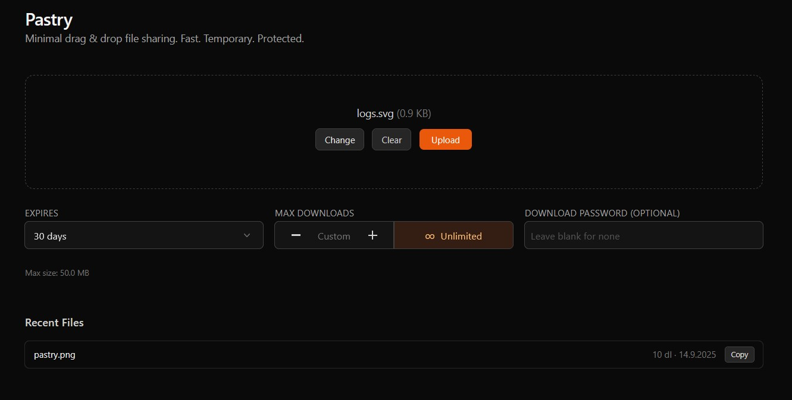
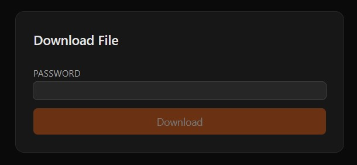
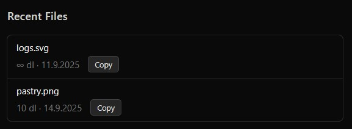

<div align="center">
  <br />
  
  <h1>P a s t r y</h1>
  <p><em>Minimal drag & drop file handoff with expirations, passwords & download limits.</em></p>
  <p>
    <a href="#quick-start">Quick Start</a> ·
    <a href="#features">Features</a> ·
    <a href="#configuration">Configuration</a> ·
    <a href="#security-model">Security</a> ·
    <a href="#cleanup--lifecycle">Cleanup</a> ·
    <a href="#roadmap">Roadmap</a>
  </p>
</div>

---

## Overview
Pastry is a lightweight, self‑hostable “pastebin for files” designed for fast, temporary hand‑offs between devices or teammates. It purposely avoids accounts, large dependency stacks and heavy persistence logic. Files are short‑lived, constrained, and always treated as untrusted.

Use cases:
- Move a build artifact from a dev machine to a laptop quickly.
- Share a screenshot or log bundle that should self‑expire.
- Provide a one‑off download with a burn‑after‑read limit.

## Why Pastry?
| Strength | Description |
|----------|-------------|
| Minimal UX | Single page drag & drop; no clutter, no marketing chrome. |
| Security‑first defaults | Forced attachment downloads, randomized filenames, optional global password policy. |
| Ephemeral by design | Expirations + max download counts + automatic background cleanup. |
| Zero external build deps | SQLite (via better‑sqlite3) by default; optional MongoDB if you outgrow local storage. |
| Simple deploy | A plain Next.js 14 app (App Router) – drop into any Node hosting target. |
| Extendable | Clear hooks for adding scanning, additional auth, storage backends, signing, etc. |

## Screenshots / Media


| Upload Panel | Download Prompt | Recent List |
|--------------|-----------------|-------------|
|  |  |  |

## Features
Core capabilities shipped in this repository:

- Drag & drop or file picker uploads
- Per‑file controls:
  - Expiration presets (15m → 30d, server clamps at 30 days)
  - Optional download password (bcrypt hashed)
  - Max downloads (burn after N) or Unlimited toggle
- Optional global policies:
  - Require password on every upload (`PASTRY_REQUIRE_FILE_PASSWORDS`)
  - Admin‑only uploads lock (`PASTRY_ADMIN_ONLY_UPLOADS` + `PASTRY_ADMIN_PASSWORD`)
- Automatic background cleanup (every minute) removing expired / exhausted files (overridable)
- Secure download flow (POST with password if required, counters increment atomically)
- Session‑scoped “recent uploads” (via opaque cookie `psid` – users cannot see others’ files)
- Randomized, non‑guessable stored filenames (nanoid)
- Strict server‑side validation (size, expiry clamp, password length, positive max downloads)
- Streaming downloads with attachment headers & sanitized filenames
- Tailwind UI with accessible custom select + refined controls

## Architecture Brief
| Layer | Responsibility |
|-------|----------------|
| Next.js API Routes | Upload, download, metadata, recent, cleanup. |
| `lib/db.ts` | Storage abstraction (SQLite or Mongo), metadata CRUD, TTL index creation (Mongo). |
| Blob Store | Local filesystem directory (`PASTRY_STORAGE_DIR`). |
| Session | Lightweight cookie to map recent uploads (no authentication). |
| Cleanup | Scheduled in‑process minute interval + manual `/api/cleanup` endpoint. |

## Quick Start
```bash
cp .env.example .env.local   # Adjust secrets & limits
npm install
npm run dev
# Open http://localhost:3000
```

## Detailed Setup
1. Clone repo & install deps.
2. Copy `.env.example` to `.env.local` and customize:
   - Set `PASTRY_ADMIN_PASSWORD` if enabling admin‑only uploads.
   - Adjust `PASTRY_MAX_FILE_SIZE` (bytes) for your environment.
   - Provide `MONGODB_URI` if you’d like server‑enforced TTL cleanup of metadata (files still cleaned by scheduler).
   - Optionally set `PASTRY_CLEANUP_TOKEN` to protect manual cleanup requests.
3. Run `npm run dev` (or `npm run build && npm start` for production).
4. Point reverse proxy / ingress at the Next.js server (ensure HTTPS if exposing publicly).

### Production Notes
- Run behind HTTPS; passwords are posted with form data.
- Consider isolating the storage directory on a low‑privilege volume.
- Enable MongoDB if you need automatic metadata expiration at DB level (TTL index is created automatically).
- Provide a process manager (systemd, PM2, docker) to ensure the in‑process cleanup interval remains active.

## Configuration
Key environment variables (see `.env.example` for the full list):

| Variable | Purpose |
|----------|---------|
| `PASTRY_MAX_FILE_SIZE` | Absolute max upload size in bytes. |
| `PASTRY_REQUIRE_FILE_PASSWORDS` | Force all uploads to specify a download password. |
| `PASTRY_ADMIN_ONLY_UPLOADS` | Gate uploads behind admin password. |
| `PASTRY_ADMIN_PASSWORD` | Password value required when admin lock enabled. |
| `PASTRY_ALLOWED_MIME_REGEX` | Optional server regex to allowlist MIME types. |
| `PASTRY_STORAGE_DIR` | Directory path for blob storage. |
| `MONGODB_URI` | Switch metadata store to Mongo (adds TTL index). |
| `PASTRY_CLEANUP_TOKEN` | Bearer token required to call `/api/cleanup` manually. |
| `PASTRY_DISABLE_SCHEDULER` | Set to `true` to disable minute cleanup (not recommended). |
| `PASTRY_LOG_LEVEL` | Log verbosity: silent, error, warn, info, debug. |
| `PASTRY_SCHEDULER_INTERVAL_MS` | Interval (ms) for the in‑process cleanup loop (default: 60000). |
| `PASTRY_FORCE_SCHEDULER` | Force enable the scheduler even if disabled or in test/CI contexts. |

## Security Model
| Control | Rationale |
|---------|-----------|
| Randomized stored names | Prevent path enumeration. |
| Attachment download | Block inline execution in browsers. |
| Expiry & max downloads | Reduce exposure window and footprint. |
| Password hashing (bcrypt) | Avoid storing plain download secrets. |
| Size & MIME guard | Bound resource use; optional type narrowing. |
| Session isolation cookie | Prevent cross‑user recent listing leakage. |
| Cleanup loop | Frees disk and prunes stale data quickly. |

### Threat Considerations
- Large file floods: mitigate via `PASTRY_MAX_FILE_SIZE` and potential upstream rate limits.
- Malware: project intentionally treats all content as hostile; integrate AV scanning hook if required.
- Brute forcing passwords: rate limiting not yet implemented – consider an upstream WAF / reverse proxy rules.

## Cleanup & Lifecycle
Files are removed in two ways:
1. Automatic minute scheduler: server issues an internal POST to `/api/cleanup` every minute (unless disabled) deleting expired / exhausted files and their metadata.
2. External/manual trigger: You (or external automation) can POST to `/api/cleanup` directly. Protect this with `PASTRY_CLEANUP_TOKEN` in production so only authorized jobs (Cron, GitHub Actions, k8s CronJob) can invoke it. This means cleanup is not coupled to user traffic—your storage will still shrink even when the UI is idle.

MongoDB deployments additionally expire metadata via TTL index; the scheduler still deletes the physical file.

### Scheduler Configuration
The built‑in cleanup loop is intentionally simple and idempotent. You can tune or override its behavior with these variables:

| Variable | Behavior | Notes |
|----------|----------|-------|
| `PASTRY_SCHEDULER_INTERVAL_MS` | Sets how often the internal loop runs. | Default 60000 (60s). Use a lower value (e.g. 5000) only for tests / demos. |
| `PASTRY_DISABLE_SCHEDULER` | Disables automatic loop entirely. | Pair with an external job calling `/api/cleanup` + token. |
| `PASTRY_FORCE_SCHEDULER` | Forces the loop to start even when other logic (e.g. test env heuristics) would skip it. | Useful in CI integration tests to exercise lifecycle behavior. |

Precedence: `PASTRY_FORCE_SCHEDULER=true` overrides `PASTRY_DISABLE_SCHEDULER=true` (force wins). If both are unset, the loop starts with the default interval.

Example `.env.local` snippet:
```
# Run cleanup every 30s instead of 60s
PASTRY_SCHEDULER_INTERVAL_MS=30000

# (Optional) Force enable in a CI job that sets PASTRY_DISABLE_SCHEDULER elsewhere
PASTRY_FORCE_SCHEDULER=true
```

### Multi‑Instance / Scaling Notes
Running multiple Pastry instances (e.g. behind a load balancer) means each instance will attempt cleanup on its own interval. This is safe because:
- Deleting an already‑deleted file is ignored.
- Metadata removal uses primary key constraints; duplicate delete attempts are no‑ops.

However, for large scale you may prefer a single external cleanup job:
1. Set `PASTRY_DISABLE_SCHEDULER=true` on all app instances.
2. Schedule a secure job (Cron, Cloud Scheduler, GitHub Action) that POSTs to `/api/cleanup` with the `Authorization: Bearer <PASTRY_CLEANUP_TOKEN>` header.

### Operational Guidance
- Keep intervals >= 30s in production to avoid unnecessary churn.
- Very short intervals (< 5s) are only recommended for automated tests where fast expiry feedback matters.
- Monitor logs at `info` or `debug` level to view each run summary.
- If storage pressure is critical, you can temporarily lower the interval, then restore to 60s.

### Security Considerations
- Always set `PASTRY_CLEANUP_TOKEN` if the service is network‑reachable; otherwise anyone could trigger aggressive cleanup bursts.
- The internal loop does not use the token—it calls the handler directly—so forgetting to set it will not break automatic cleanup.
- Avoid exposing the cleanup endpoint publicly without a token even if you believe obscurity suffices.

## Roadmap
- Chunked / resumable uploads
- Pluggable antivirus / content scanning hook
- Signed temporary “one click” share links
- Optional S3 / object storage backend
- Rate limiting & abuse throttling
- Multi‑file batch uploads
- Progress bars + pause/resume

## Contributing
Issues & PRs welcome. Please:
1. Open an issue for substantial feature proposals first.
2. Add tests (Vitest) for new server behaviors.
3. Keep dependencies minimal; prefer small, audited libs.

## License
Released under the MIT License. See [LICENSE](./LICENSE).
